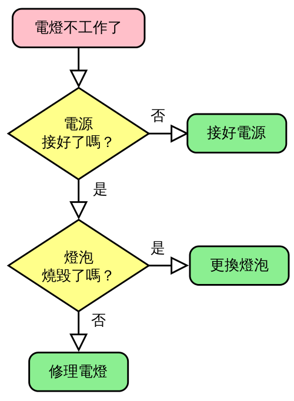

# 程式語言概論

本課程嘗試以不同風格的程式語言，配合不同的背景能力或興趣，選擇適合自己學習的範例。雖說是不同的程式語言，但有其共同邏輯原理，在本文中予以事先闡明，可以提高將來面對新環境時，應用時的多樣性。  
由於實際的程式撰寫通常會有多相關人員的參與，而「系統需求者」在與程式設計人員溝通時，往往需要大量的溝通，甚至在完成程式撰寫前，也需要將系統的邏輯加以釐清，因此有各式各樣的表達，讓程式設計師在開始工作前，先將架構清楚描述，最常見的工具有下列三種：

* 文字敘述： 以文字敘述問題步驟，可以便捷快速的「寫」出步驟，但通常無法結構化的描述，有時也會造成冗長贅述，語義不清。通常只會用於問題概述，或是簡單流程。
* 虛擬碼： 在文字中夾雜程式程式語言，通常在有一定程式經驗時，以自己熟悉的文字描述，遇到難以文字敘述的流程與邏輯時，即以程式語言或數學公式帶入。
* 流程圖： 以圖型的方式表達問題，是目前最流通的描述方式，也有許多免費工具提供便捷使用，是目前主要共同溝通的重要工具，在下面章節會有更詳盡的說明。

### 流程圖（本節內容摘自維基百科[https://zh.wikipedia.org/wiki/](https://zh.wikipedia.org/wiki/%E6%B5%81%E7%A8%8B%E5%9B%BE)\)

**流程圖**是表示[演算法](https://zh.wikipedia.org/wiki/%E7%AE%97%E6%B3%95)、[工作流](https://zh.wikipedia.org/wiki/%E5%B7%A5%E4%BD%9C%E6%B5%81%E6%8A%80%E6%9C%AF)或流程的一種方塊圖表示，它以不同類型的框代表不同種類的步驟，每兩個步驟之間則以箭頭連接。這種表示方法便於說明解決已知[問題](https://zh.wikipedia.org/wiki/%E8%A7%A3%E5%86%B3%E9%97%AE%E9%A2%98)的方法。流程圖在分析、設計、記錄及操控許多領域的流程或程式都有廣泛應用。  
概覽。  
流程圖背後可以概括了各節點類型、其內容及其他補充用的資訊。在設計或者記錄一些簡單的步驟或程式都會用得上流程圖。與其他圖表一樣，這種圖表可以幫助視覺化發生了甚麼事情，從而更易去理解中間的工序。雖然有很多𗗠生出來的版本，各目有各目的標示方式，它們大都都有以下2種的符號：

* **步驟**：通常稱作「活動」，常以長方形來表示
* **決定**：常以鑽石形來表示

#### 常用符號

[美國國家標準協會](https://zh.wikipedia.org/wiki/%E7%BE%8E%E5%9C%8B%E5%9C%8B%E5%AE%B6%E6%A8%99%E6%BA%96%E5%8D%94%E6%9C%83)是1960年代就開始制定流程圖及一些標準符號。而在1970年，[國際標準化組織](https://zh.wikipedia.org/wiki/%E5%9C%8B%E9%9A%9B%E6%A8%99%E6%BA%96%E5%8C%96%E7%B5%84%E7%B9%94)採用其方案。現時通用的版本ISO 5807是在1985年修訂。以下圖例列出一些ISO常用符號。

<table>
  <thead>
    <tr>
      <th style="text-align:left">&#x5F62;&#x72C0;</th>
      <th style="text-align:left">&#x540D;&#x7A31;</th>
      <th style="text-align:left">&#x63CF;&#x8FF0;</th>
    </tr>
  </thead>
  <tbody>
    <tr>
      <td style="text-align:left">
      </td>
      <td style="text-align:left">
        
<b>&#x6D41;&#x7A0B;&#x7B26;&#x865F;</b>
        

        
Flowline (Arrowhead)

      </td>
      <td style="text-align:left">&#x7528;&#x4F86;&#x8868;&#x9054;&#x904E;&#x7A0B;&#x7684;&#x6B21;&#x5E8F;&#xFF0C;&#x7528;&#x4E00;&#x689D;&#x7DDA;&#x7531;&#x4E00;&#x500B;&#x7B26;&#x865F;&#x9023;&#x63A5;&#x53BB;&#x5230;&#x53E6;&#x4E00;&#x500B;&#x7B26;&#x865F;&#x3002;&#x5982;&#x679C;&#x4E0D;&#x662F;&#x6A19;&#x6E96;&#x7684;&#x4E0A;&#x81F3;&#x4E0B;&#x3001;&#x5DE6;&#x81F3;&#x53F3;&#x5716;&#x5C31;&#x6703;&#x52A0;&#x4E0A;&#x7BAD;&#x982D;&#x3002;</td>
    </tr>
    <tr>
      <td style="text-align:left">
      </td>
      <td style="text-align:left">
        
<b>&#x8D77;&#x6B62;&#x7B26;&#x865F;</b>
        

        
Terminal

      </td>
      <td style="text-align:left">&#x7528;&#x4F86;&#x8868;&#x793A;&#x6B21;&#x8981;&#x6216;&#x7A0B;&#x5F0F;&#x7684;&#x958B;&#x59CB;&#x8207;&#x5B8C;&#x7D50;&#x3002;&#x5E38;&#x4EE5;&#x4E00;&#x500B;&#x5713;&#x89D2;&#x9577;&#x65B9;&#x5F62;&#x8868;&#x793A;&#x3002;&#x901A;&#x5E38;&#x88CF;&#x9762;&#x6703;&#x6A19;&#x4E0A;&#x300C;&#x958B;&#x59CB;&#x300D;&#x6216;&#x300C;&#x7D50;&#x675F;&#x300D;&#x6216;&#x5176;&#x4ED6;&#x76F8;&#x95DC;&#x5B57;&#x773C;&#xFF0C;&#x5982;&#x300C;&#x63D0;&#x4EA4;&#x67E5;&#x8A62;&#x300D;&#x6216;&#x300C;&#x63A5;&#x53D7;&#x7522;&#x54C1;&#x300D;&#x3002;</td>
    </tr>
    <tr>
      <td style="text-align:left">
      </td>
      <td style="text-align:left">
        
<b>&#x7A0B;&#x5F0F;</b>
        

        
Process

      </td>
      <td style="text-align:left">&#x4EE5;&#x9577;&#x65B9;&#x5F62;&#x4F86;&#x4EE3;&#x8868;&#x4E00;&#x7CFB;&#x5217;&#x7A0B;&#x5F0F;&#x53BB;&#x6539;&#x8B8A;&#x6578;&#x503C;&#x3001;&#x5F62;&#x5F0F;&#x3001;&#x6578;&#x64DA;&#x7684;&#x4F4D;&#x7F6E;&#x3002;</td>
    </tr>
    <tr>
      <td style="text-align:left">
      </td>
      <td style="text-align:left">
        
<b>&#x6C7A;&#x7B56;&#x5224;&#x65B7;</b>
        

        
Decision

      </td>
      <td style="text-align:left">&#x4EE5;&#x4E00;&#x500B;&#x83F1;&#x5F62;&#x53BB;&#x986F;&#x793A;&#x4E00;&#x500B;&#x689D;&#x4EF6;&#x9032;&#x7A0B;&#xFF0C;&#x7528;&#x4F86;&#x6309;&#x60C5;&#x6CC1;&#x53BB;&#x6C7A;&#x5B9A;&#x4E0B;&#x4E00;&#x6B65;&#x8D70;&#x5411;&#x3002;&#x901A;&#x5E38;&#x4EE5;&#x300C;&#x662F;/&#x5426;&#x300D;&#x6216;&#x300C;&#x771F;/&#x5047;&#x300D;&#x503C;&#x53BB;&#x6C7A;&#x5B9A;&#x3002;</td>
    </tr>
    <tr>
      <td style="text-align:left">
      </td>
      <td style="text-align:left">
        
<b>&#x8F38;&#x5165;/&#x8F38;&#x51FA;</b>
        

        
Input/Output

      </td>
      <td style="text-align:left">&#x4EE5;&#x5E73;&#x884C;&#x56DB;&#x908A;&#x5F62;&#x4F86;&#x6A19;&#x793A;&#x6578;&#x64DA;&#x8F38;&#x5165;&#x6216;&#x8F38;&#x51FA;&#x7684;&#x904E;&#x7A0B;&#xFF0C;&#x5373;&#x586B;&#x5165;&#x6578;&#x64DA;&#x6216;&#x986F;&#x793A;&#x5DE5;&#x4F5C;&#x7D50;&#x679C;&#x7684;&#x6B65;&#x9A5F;&#x3002;</td>
    </tr>
    <tr>
      <td style="text-align:left">
      </td>
      <td style="text-align:left">
        
<b>&#x8A3B;&#x89E3;</b>
        

        
Annotation(Comment)

      </td>
      <td style="text-align:left">&#x7528;&#x4F86;&#x88DC;&#x5145;&#x67D0;&#x6B65;&#x9A5F;&#x7684;&#x984D;&#x5916;&#x8CC7;&#x8A0A;&#xFF0C;&#x53EF;&#x7528;&#x4E00;&#x500B;&#x865B;&#x7DDA;&#x4F86;&#x9023;&#x63A5;&#x4E00;&#x500B;&#x534A;&#x9589;&#x5408;&#x7684;&#x9577;&#x65B9;&#x578B;&#x81F3;&#x60F3;&#x8A3B;&#x91CB;&#x7684;&#x7B26;&#x865F;&#x4E2D;&#x3002;</td>
    </tr>
    <tr>
      <td style="text-align:left">
      </td>
      <td style="text-align:left">
        
<b>&#x5DF2;&#x5B9A;&#x7FA9;&#x6D41;&#x7A0B;</b>
        

        
Predefined Process

      </td>
      <td style="text-align:left">&#x7528;&#x4E00;&#x500B;&#x6709;2&#x689D;&#x5DE6;&#x53F3;&#x5782;&#x76F4;&#x7DDA;&#x9577;&#x65B9;&#x578B;&#xFF0C;&#x4F86;&#x8868;&#x793A;&#x4E00;&#x500B;&#x5DF2;&#x5728;&#x5176;&#x4ED6;&#x5730;&#x65B9;&#x5B9A;&#x7FA9;&#x4E86;&#x7684;&#x904E;&#x7A0B;&#x3002;</td>
    </tr>
    <tr>
      <td style="text-align:left">
      </td>
      <td style="text-align:left">
        
<b>&#x540C;&#x9801;&#x53C3;&#x8003;</b>
        

        
On-page Connector

      </td>
      <td style="text-align:left">&#x7528;&#x4E00;&#x500B;&#x542B;&#x6709;&#x5B57;&#x6BCD;&#x7684;&#x5C0F;&#x5713;&#x5708;&#x4F86;&#x9023;&#x63A5;&#x76EE;&#x6A19;&#x6D41;&#x7A0B;&#x756B;&#x65BC;&#x540C;&#x4E00;&#x9801;&#x4E0A;&#x3002;</td>
    </tr>
    <tr>
      <td style="text-align:left">
      </td>
      <td style="text-align:left">
        
<b>&#x63DB;&#x9801;&#x53C3;&#x8003;</b>
        

        
Off-page Connector

      </td>
      <td style="text-align:left">&#x7528;&#x4E00;&#x500B;&#x5012;&#x756B;&#x7684;&#x5C4B;&#x578B;&#x4F86;&#x8868;&#x793A;&#x76EE;&#x6A19;&#x6D41;&#x7A0B;&#x756B;&#x65BC;&#x53E6;&#x4E00;&#x9801;&#x4E0A;&#x3002;</td>
    </tr>
  </tbody>
</table>

#### 其他符號

除了上述的基本符號，舉例以下：

<table>
  <thead>
    <tr>
      <th style="text-align:left">&#x5F62;&#x72C0;</th>
      <th style="text-align:left">&#x540D;&#x7A31;</th>
      <th style="text-align:left">&#x63CF;&#x8FF0;</th>
    </tr>
  </thead>
  <tbody>
    <tr>
      <td style="text-align:left">
      </td>
      <td style="text-align:left">
        
<b>&#x6578;&#x64DA;&#x6A94;&#x6216;&#x8CC7;&#x6599;&#x5EAB;</b>
        

        
Data File or Database

      </td>
      <td style="text-align:left">&#x7528;&#x4E00;&#x500B;&#x5713;&#x67F1;&#x4F86;&#x8868;&#x793A;&#x8CC7;&#x6599;&#x5EAB;&#x3002;</td>
    </tr>
    <tr>
      <td style="text-align:left">
      </td>
      <td style="text-align:left">
        
<b>&#x6A94;&#x6848;</b>
        

        
Document

      </td>
      <td style="text-align:left">&#x7528;&#x4E00;&#x500B;&#x9644;&#x6709;&#x6CE2;&#x6D6A;&#x5F62;&#x5E95;&#x7684;&#x9577;&#x65B9;&#x5F62;&#x4F86;&#x6A19;&#x793A;&#x6A94;&#x6848;&#x3002;</td>
    </tr>
    <tr>
      <td style="text-align:left">
      </td>
      <td style="text-align:left">&#x7528;&#x591A;&#x500B;&#x9644;&#x6709;&#x6CE2;&#x6D6A;&#x5F62;&#x5E95;&#x7684;&#x9577;&#x65B9;&#x5F62;&#x4F86;&#x6A19;&#x793A;&#x591A;&#x4EFD;&#x6A94;&#x6848;&#x3002;</td>
      <td
      style="text-align:left"></td>
    </tr>
    <tr>
      <td style="text-align:left">
      </td>
      <td style="text-align:left">
        
<b>&#x986F;&#x793A;</b>
        

        
Display

      </td>
      <td style="text-align:left">&#x7528;&#x4E00;&#x500B;&#x5DE6;&#x4E09;&#x89D2;&#x6B63;&#x65B9;&#x53F3;&#x5713;&#x89D2;&#x5F62;&#x72C0;&#x4F86;&#x6A19;&#x793A;&#x7D50;&#x679C;&#x986F;&#x793A;&#x7684;&#x904E;&#x7A0B;&#x3002;</td>
    </tr>
    <tr>
      <td style="text-align:left">
      </td>
      <td style="text-align:left">
        
<b>&#x4EBA;&#x5DE5;&#x64CD;&#x4F5C;</b>
        

        
Manual operation

      </td>
      <td style="text-align:left">&#x7528;&#x4E00;&#x500B;&#x76F4;&#x89D2;&#x534A;&#x68AF;&#x5F62;&#x4F86;&#x6A19;&#x793A;&#x9700;&#x8981;&#x4EBA;&#x624B;&#x9304;&#x5165;&#x3001;&#x4FEE;&#x6B63;&#x6216;&#x64CD;&#x4F5C;&#x7684;&#x904E;&#x7A0B;&#x3002;</td>
    </tr>
    <tr>
      <td style="text-align:left">
      </td>
      <td style="text-align:left">
        
<b>&#x521D;&#x59CB;&#x5316;</b>
        

        
Preparation or Initialization

      </td>
      <td style="text-align:left">&#x7528;&#x4E00;&#x500B;&#x62C9;&#x9577;&#x4E86;&#x7684;&#x516D;&#x89D2;&#x5F62;&#x4F86;&#x4EE3;&#x8868;&#x521D;&#x59CB;&#x5316;&#x6216;&#x9810;&#x5099;&#x7684;&#x904E;&#x7A0B;&#x3002;</td>
    </tr>
  </tbody>
</table>

#### 繪製工具

許多工具都可以繪製流程圖，最簡單的是文具行販售的「流程圖規尺」，有些軟體甚至可以將流程圖背後的數據模型記錄下來，方便與資料庫、[專案管理](https://zh.wikipedia.org/wiki/%E9%A1%B9%E7%9B%AE%E7%AE%A1%E7%90%86)或[電子試算表](https://zh.wikipedia.org/wiki/%E9%9B%BB%E5%AD%90%E8%A9%A6%E7%AE%97%E8%A1%A8)等軟體協作。甚至可以將編程原始碼或指定的流程圖描述碼來轉換出來。常見有[Microsoft Office Visio](https://zh.wikipedia.org/wiki/Microsoft_Office_Visio)[draw.io](http://draw.io)，都可以製作流程圖。也有一些軟體可以將編程原始碼或指定的流程圖描述碼來轉換出來。

### 程式邏輯

在我們日常生活中，有著許許多多，要經由一定的程序完成的事務，例如：食譜、加油的步驟，買電影票，都有著一定的步驟，這些步驟經由整理歸納後，完整的表達出來，讓人們可以模仿或是重置或是交接任務；如果要將這些步驟寫成程式可以透過「演算法」。

以下是[高德納](https://zh.wikipedia.org/wiki/%E9%AB%98%E5%BE%B7%E7%BA%B3)在他的著作《[電腦程式設計藝術](https://zh.wikipedia.org/wiki/%E8%AE%A1%E7%AE%97%E6%9C%BA%E7%A8%8B%E5%BA%8F%E8%AE%BE%E8%AE%A1%E8%89%BA%E6%9C%AF)》裡對演算法的特徵歸納：

* 輸入：一個演算法必須有零個或以上輸入量。
* 輸出：一個演算法應有一個或以上輸出量，輸出量是演算法計算的結果。
* 明確性：演算法的描述必須無歧義，以保證演算法的實際執行結果是精確地符合要求或期望，通常要求實際執行結果是確定的。
* 有限性：依據圖靈的定義，一個演算法是能夠被任何[圖靈完備](https://zh.wikipedia.org/wiki/%E5%9B%BE%E7%81%B5%E5%AE%8C%E5%85%A8)系統類比的一串運算，而[圖靈機](https://zh.wikipedia.org/wiki/%E5%9C%96%E9%9D%88%E6%A9%9F)只有有限個狀態、有限個輸入符號和有限個轉移函式（指令）。而一些定義更規定演算法必須在有限個步驟內完成任務。
* 有效性：又稱可行性。能夠實現，演算法中描述的操作都是可以通過已經實現的基本運算執行有限次來實現。

### 註解

在學習編輯程式碼前，一定要習慣在

### 變數

### 運算元

### 判斷

### 迴圈

