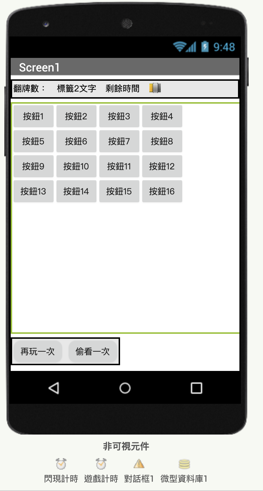

# 配對猜猜

## 第一節 遊戲說明

遊戲的介面介面設計如圖1-1所示，功能描述如下：



1. 螢幕上配置16張牌，在一定時間內（例如30秒倒數），將兩兩相對的牌，找尋出來。
2. 遊戲起始：將所有牌面設為相同（背面）
3. 使用者介面安排4x4方陣，初始時顯示背面圖案，16張卡片以8種\(以上\)的圖案，兩兩隨機排列在4x4的方陣之中。
4. 遊戲操作：玩家先翻開兩張卡片，如果兩張圖案是相同的，則得分。如果兩張不同，俟下次翻牌時，將前次翻牌翻回背面。
5. 計分：如果在一定時間內完成8對，則得分80分，十秒內完成，則得分20分，超過10秒，則每秒加一分。超過時間不計分。
6. 玩家可以選擇「偷看一次」，時間直接扣除10秒。
7. 玩家在完成遊戲後，可以選擇再玩一次，並記錄目前最高分。

图1- 1 水果配对游戏的用户界面

在软件工程中，“游戏描述”被称为软件开发文档中的“需求文档”，是整个软件开发过程中的第一个文档，也是撰写其他文档的重要依据，后续文档包括设计文档、测试文档及用户手册等，都要以这个文档为出发点，因此这个文档的撰写至关重要。

游戏描述与记叙文的写作有相似之处：记叙文中包含了时间、地点、人物、事件四大关键要素，而游戏描述中通常也会包含时间、空间、角色、事件等基本要素，也要描述角色在特定的时间、空间内的行为（所发生的事件）。

此外，游戏描述又与说明文相像，要求文字简练准确，内容具有条理性、客观性和完整性，不强调修辞方法的使用等等。一篇好的游戏描述为我们后续的应用程序开发提供了一份完整的框架及任务清单，我们的每一个开发步骤都会依据于这份文档，因此，前往不可对此掉以轻心。

有一种说法：需求文档中隐含了程序中的变量和过程，其中的名词有可能成为程序中的全局变量，而动词或动宾词组有可能成为程序中的过程。具体说，在游戏描述的第一条中，游戏时长、剩余时间及奖励因数都有可能成为程序中的全局变量；在第三条中，翻牌、闪现、反转等，有可能成为程序中的过程。如果名词、动词能够与变量、过程一一对应，那么编程的难度会大大降低，但实际上，游戏描述使用的是人类的自然语言，而自然语言存在很大的不确定性，同样的一个游戏，不同的人有可能使用不同的方法来描述它，因此，这种说法可以借鉴，但不能作为绝对的依据，将复杂的问题简单化。

## 第二節 畫面編排

**1、界面布局**

屏幕被划分为两个部分：在屏幕顶部，使用了水平布局组件，内部放置了显示分数的标签和显示游戏剩余时间的数字滑动条；在屏幕的中央，使用了4X4表格布局组件，共16个单元格，每个单元格中放置一个按钮，来实现点击翻牌功能。如图1- 2所示。其中的组件清单见表1- 1，组件的属性设置见表1- 2。图1- 2设计游戏的用户界面

表1- 1 组件清单 

**2、组件属性设置**

表1- 2 组件的属性设置 

**3、上传资源文件**

在组件属性设置完成后，上传游戏中将要用到的资源文件。如表1- 3所示，共10张图片，其中用于显示卡片正面图案的水果图片8张、卡片的背面图片1张，用于产品发布的图标图案1张（菠萝的卡通画，ananas.jpg）。上传结果如图1- 3所示。图1- 3 上传资源文件\(图片\)

表1- 3 资源规格\(大小：80×80，单位：像素\) 

## 第三節 程式設計：螢幕初始化

如果把编写软件比喻为烹制一道菜肴，那么用户界面上的元素就相当于制作这道菜肴的全部食材；当材料备齐之后，就可以考虑进入烹制过程了。就软件而言，当用户界面设计完成之后，就可以开始编写代码了。

我们很自然地会问，从哪里开始呢？无论是对于初学者，还是对于有经验的程序员，都无法回避这个问题。通常的做法是，沿着游戏的时间顺序来编写程序。但是对于初学者来说，也可以从最简单的功能做起，例如，先设置按钮的背面图案，然后针对这个按钮，当点击它时，让按钮显示正面图案；然后再考虑第二个按钮，当点击第二个显示背面图案的按钮时，如何处理可能出现的两种情况：两张卡片的图案相同或不同。这里我们采用通常的做法，首先来编写屏幕初始化程序，在这段程序中，最终要将8对（16张）不同的图案分配给16个按钮。

【注：这个功能的实现依赖于两项关键技术——列表操作以及随机数的使用。这里假设你已经了解了App Inventor中关于列表及随机数的知识，如果你还没有学习过相关的技术，推荐你访问[http://www.17coding.net/，阅读《App](http://www.17coding.net/%EF%BC%8C%E9%98%85%E8%AF%BB%E3%80%8AApp) Inventor编程实例及指南》中的“总统测验”及“瓢虫快跑”两章，或访问[http://www.17coding.net/reference，阅读参考手册中的相关条目。】](http://www.17coding.net/reference%EF%BC%8C%E9%98%85%E8%AF%BB%E5%8F%82%E8%80%83%E6%89%8B%E5%86%8C%E4%B8%AD%E7%9A%84%E7%9B%B8%E5%85%B3%E6%9D%A1%E7%9B%AE%E3%80%82%E3%80%91)

**1、创建按钮列表**

首先我们引入一个新的概念——组件对象。我们可以在编程视图中，随意点击一个项目中的组件，打开该组件的代码块抽屉，你会发现，在代码块的最后一行，总有一个与该组件同名的代码块，这个代码块代表了这个组件本身，我们称之为组件对象，对于按钮来说，就是按钮对象。如图1- 4所示，红色线条圈住的就是表格布局对象。你可以把组件对象看作是一类特殊的数据（比如由键值对组成的列表），它里面包含了该组件的所有属性值。图1- 4 组件对象

在为了能够在程序运行过程中，读取或改写任意一个按钮的属性，我们需要利用按钮对象类数据。将所有按钮对象放置到一个列表变量中，这样就可以依据列表项的索引值，随时找到任何一个按钮，并读写它的属性值。

首先声明一个全局变量按钮列表，并编写一个创建按钮列表过程，在该过程中，完成列表项的设置，然后在屏幕初始化程序中调用该过程。如图1- 5所示。这个列表的神奇之处稍后你就能有所体会。图1- 5 创建按钮列表

这里要问一个问题：为什么我们要在屏幕初始化程序中来创建按钮列表，而不是在声明按钮列表时，直接利用按钮对象对变量做初始化呢？像图1- 6所示的那样。图1- 6 不能将组件直接设置为变量的值

原因是这样的：在屏幕初始化过程中，程序首先要创建项目中的所有组件和全局变量，但是，由于组件和变量的生成顺序无法确定，因此在声明全局变量（按钮列表）时，无法确认组件（按钮）是否已经创建完成，因此App Inventor不允许使用组件对象对全局变量进行初始化。图1-6中的红色三角形代表“警告”，“警告”意味着程序中存在严重的错误。

**2、让按钮显示背面图案**

我们可以在设计视图中将每个按钮的图像属性设置为“back.png”，这样当游戏被打开时，16个按钮会默认显示背面图案（安卓机器人）。但你试想一下，当第一轮游戏结束，准备开始下一轮游戏时，如何将16个按钮上的正面图案全部改为背面图案呢？也就是说，如何在程序运行过程中设置每个按钮的图像属性呢？当然，你可以逐个地设置，这需要16行代码，那么有没有更为简便的方法呢？当然，App Inventor提供了一组“任意组件”代码，可以用来动态地读取或改写任何一个组件的属性。如图1- 7所示。图1- 7 App Inventor提供的“任意组件”代码

在编程视图的代码块面板中，将内置块和Screen1折叠起来，就可以看到最后一组任意组件类代码块，项目中添加的所有组件类型都会在这里出现。点击其中的任意按钮项，将打开与按钮类组件相关的代码块抽屉，其中有两种颜色的块：浅绿和深绿，浅绿色块用于读取某个按钮组件的某一项属性（如图像属性），深绿色块用于设置某个按钮组件的某一项属性。

“组件对象列表+循环+任意组件”是解决上述问题的钥匙！代码如图1- 8所示，测试结果如图1- 9所示。图1- 8 列表+循环+任意组件——设置每个按钮的图形属性图1- 9 按钮显示背面图案

这里我们需要提醒一下，屏幕初始化后，按钮的排列顺序如图1- 10所示。图1- 10 按钮的排列顺序

**3、创建图片列表**

声明一个全局变量图片列表，用来保存所有正面图案的图片文件名，如图1- 11所示。图1- 11 初始化图片列表

此处，我们在声明全局变量图片列表的同时，创建了该列表，与之前按钮列表的创建相比较，我们可以更加深入地理解普通数据与组件对象类数据之间的区别。

**4、为按钮指定正面图案**

首先需要说明一下，这个步骤并不是游戏开发过程中所需要的，这里只是为了让读者了解如何设置按钮的正面图案，因此，这里显示的图片是按照固定顺序排列的。我们设置按钮1和按钮9具有相同的正面图案，同样，按钮2和按钮10具有相同的正面图案，以此类推。与设置背面图案相同的是，这里也要使用“组件对象列表+循环+任意组件”这把钥匙；不同的是，图像属性的值来自于另一个列表变量——图片列表。设置正面图案的代码如图1- 12所示，其测试结果如图1- 13所示。图1- 12设置卡片的正面图案图1- 13设置卡片的正面图案

为了让屏幕初始化程序看起来简洁，提高代码的可读性，我们创建一个初始化正面图案过程，并在屏幕初始化程序中调用该过程，如图1- 14所示。尽管这个过程不是游戏程序中必须的，但我们还是自始至终地保持一种良好的开发习惯——将一段具有特定功能的代码封装为过程，以使程序从整体上变得简洁，且易于阅读。图1- 14 创建初始化正面图案过程，并在屏幕初始化程序中调用该过程

**5、随机显示正面图案**

在图1- 13中，卡片的图案是有规律排列的，如果卡片一直是这样排列，那么游戏将毫无乐趣可言。游戏的乐趣在于其多变性，就像我们玩儿扑克牌游戏，每次手中拿到的牌都是不一样的，这种不可预知的变化才使得游戏充满乐趣和挑战。几乎所有的编程语言，都有生成随机数的功能，App Inventor也不例外。我们来看看如何利用App Inventor的列表及随机数功能来实现类似洗牌的操作。

洗牌原理叙述如下：

1. 需要两个列表，A和B，开始时，列表A按顺序放置了8对\(16个\)图案，列表B为空；
2. 从A中随机选出一个列表项X，添加到列表B中，并从A中删除列表项X；
3. 从A中剩余的所有列表项中随机选出一个列表项Y添加到B中，再从A中删除Y；
4. 重复第3步直到列表A为空，此时列表B中随机排列了8对\(16个\)图案；
5. 分别将这16个图案设置为按钮1～16的图像属性。

根据上述原理，我们首先来设计列表A。由于列表A最终要被删除掉所有的列表项而成为空列表，因此不必使用全局变量来保存它。我们创建一个随机显示图案过程，在该过程中用临时变量图案列表来充当列表A，并用双倍的图片列表来填充图案列表（列表A）。其次考虑列表B。声明一个全局变量随机图案列表来充当列表B，并设置其初始值为空列表。如图1- 15所示。图1- 15 定义随机显示图案过程

对照上述的洗牌原理，我们可以理解图1- 15中每一行代码的作用。也许你会问，为什么要设置一个随机列表，它似乎与图案的显示无关。如果只是让16个按钮随机显示16个图案，那么列表B（随机列表）的确是多余的，你可以试试看，即使删除过程中与随机列表相关的代码，也不会影响图案的随机显示。但是不要忘记，这个过程只是为了向读者展示如何为按钮随机分配正面图案，真正的游戏中并不会在游戏一开始就向玩家展示所有正面图案。随机列表的作用要到后面的程序中才能体现出来。图1- 16 让卡片随机显示图案

好了，到此为止，我们已经实现了用16个按钮随机显示16个图案的功能，不过在游戏开始时，我们只需要所有按钮显示背面图案。我们将图1- 15中的代码稍作修改，得到的新代码如图1- 17所示。注意，在游戏中我们不需要一次性地随机显示正面图案，因此随机显示图案的过程名称显得有些不够贴切，我们将过程名改为随机分配图案。图1- 17 修改后的随机分配图案过程及屏幕初始化程序

上述代码有两点需要强调，①为了保持屏幕初始化程序的简洁，我们定义了初始化背面图案过程，并在屏幕初始化程序中调用该过程；②虽然删除了随机分配图案过程中设置按钮图像属性的代码，但要记住，按钮列表中的列表项与随机列表中的列表项存着一一对应的关系，在后来翻开卡片显示图案，以及判断两个卡片图案是否相同时，这是唯一的线索。表1- 4描述了图1- 16中按钮列表与随机列表之间列表项的对应关系。

表1- 4 图1- 16中按钮列表与图案随机列表的对应关系 

我们现在已经实现了16个按钮的随机图案设置，并在程序开始运行时，只显示背面图案，下面将针对每个按钮设计它们被点击后程序的行为。

## 第四節 程式設計：處理按鍵點擊事件

**1、流程图**图1- 18 按钮点击事件引发的处理流程

图1- 18中的流程有三种可能的路径：如果点击按钮翻开的的是第一张卡片，则执行路径①——记住第一张卡片；如果点击按钮翻开的是第二张卡片，则记住第二张卡片，并判断两张卡片图案的异同，如果相同，则执行路径②，否则，执行路径③；无论是执行路径②或路径③，最后到要忘记两张卡片。

注意流程图中的三个矩形框：记住第一张卡片、记住第二张卡片、忘记两张卡片，这是编写程序的关键。所谓记住或忘记，就是要用全局变量来记录已经翻开的卡片。这里我们声明两个全局变量：翻牌1及翻牌2，来保存正在翻开等待判断的两个按钮对象。在应用初始化时，设置它们的值为0 ，当第一张牌被翻开时，设

```text
翻牌1 = 第一个被点击的按钮对象
```

当第二张牌被翻开时，设

```text
翻牌2 = 第二个被点击的按钮对象
```

并以这两个变量为依据，判断按钮图案的异同。

**2、判断两个按钮图案的异同**

我们先以按钮1及按钮2为例来编写代码，如图1- 19所示。图1- 19 以按钮1及按钮2为例编写的点击事件处理程序

当按钮1或按钮2被点击时，事件处理程序的执行过程如下：

1. 根据按钮对象在按钮列表中的位置（索引值），从随机图案列表中获取按钮的正面图案，并显示该图案；
2. 设置被点击按钮的启用属性值为假（考虑一下为什么，如果不这样，当再次点击该按钮时，会发生什么事情？）；
3. 判断它是不是第一张被翻开的卡片，如果是，将翻牌1设置为该按钮对象，否则，将翻牌2设置为该按钮对象，并判断已经翻开的两个按钮的正面图案是否相同。这里我们暂时不做进一步的处理，而是利用屏幕的标题属性来显示测试结果，即，如果按钮1与按钮2的图案相同，则屏幕的标题显示“图案相同”，否则显示“图案不同”；
4. 如果已经翻开两张卡片，无论它们的正面图案是否相同，都必须重新将翻牌1及翻牌2的值设置为0。

测试结果如图1- 20所示。图1- 20 对上述代码的测试结果

**3、处理两个按钮图案相同的情况**

按照图1- 18的设计，当图案相同时，记住已经翻开的卡片对数。凡是需要记住的内容，都需要一个全局变量来保存它，已翻开卡片的对数一方面用于计算游戏得分，另一方面用于判断是否所有卡片都已经被翻开（等于8时）。我们将这个变量命名为翻牌对数。

当两张卡片的正面图案相同时，有三件事情需要完成：

1. 为全局变量翻牌对数的值+1；
2. 计算并显示游戏得分；
3. 判断翻牌对数是否等于8，并依据判断结果选择执行两条路径之中的一条：
   * 当翻牌对数=8时，显示“游戏结束”；或者
   * 当翻牌对数&lt;8时，显示“图案相同”。

假设每翻开一对卡片得10分，因此游戏得分 = 翻牌对数X10，我们用标签得分来显示游戏得分，具体代码如图1-21所示。图1- 21 当两张卡片图案相同时，显示分数，如果翻牌对数=8，则游戏结束

**4、处理两个按钮图案不同的情况**

当两张被翻开的卡片图案不同时，将它们重新扣上，即，让它们显示背面图案。为了让已经翻开的图片能够显示一定的时间，这里需要用到计时器组件，一旦判断出两个卡片图案不同，则启动计时器，经过一个计时间隔的时长后，计时器发生计时事件，在计时事件的处理程序中，将两张卡片同时扣上。我们用闪现计时器来实现这一功能。这里闪现计时器的计时间隔为500毫秒，如果需要加大游戏的难度，可以将计时间隔设置的更短。

我们在“图案不同”的分支里添加一个语句——启动闪现计时器，并编写了闪现计时器的计时事件处理程序，如图1- 22所示。图1- 22 当两张卡片图案不同时，启动闪现计时器

在闪现计时器的计时事件中，我们设置两个按钮的启用属性为真，图像属性为背面图案，并将计时器1的启用属性设置为假，即，让计时器1停止计时。经过测试，程序运行正常。

**5、代码的复用——改进按钮点击事件处理程序**

到目前为止，我们已经能够处理两个按钮的点击事件，我们需要将按钮1点击事件处理程序中的代码复制到其他14个按钮的点击事件处理程序中。这种说法听起来很可怕，试想，如果我们开发过程中需要修改其中的部分代码（这种事情经常会发生），那么我们要完成额外15倍的工作量，同时也增加了程序出错的风险。即便是我们能够一丝不苟地完成这些代码，但如何编写闪现计时器的计时事件处理程序呢？因此我们需要寻找一个更为简洁的代码编写方法。让我们先来观察一下已有的两个按钮的点击事件处理程序，如图1- 23所示。图1- 23 比较两个按钮的点击事件处理程序

经过观察，我们发现这两段程序中，共有7处不同，其中4四处与按钮本身有关，另外3处与索引值有关——按钮正面图案在随机图案列表中的位置。能否创建一个通用的过程，来处理不同按钮的点击事件，就取决于能否合理地设置过程的参数，并在调用该过程时，为参数指定确切的值。能够想到的参数就是按钮本身——按钮对象，而正面图案在随机列表中的索引值，可以通过按钮在按钮列表中的索引值获得。很不错的分析，让我们来试试看。

创建一个带参数的过程，过程名为处理点击事件，参数名为某按钮，将按钮1的代码拖拽到新建的过程中，然后对代码进行改造，如图1- 24所示：

1. 添加一个局部变量图案索引值：求某按钮在按钮列表中的位置，前面我们讲过，按钮列表与随机图案列表中的列表项是一一对应的，因此某按钮在按钮列表中的位置也是它的正面图案在随机图案列表中的位置；
2. 使用“任意组件”类代码来取代原来的前两行代码——设置某按钮的图像属性为正面图案，设置某按钮的启用属性为假；
3. 当被点击的两张卡片图案不同时，添加一个局部变量翻牌1图案索引值，求出第一张翻开的卡片其正面图案在随机图案列表中的位置，并使用两个局部变量（翻牌1图案索引值及图案索引值）来求得两个卡片的正面图案；
4. 在按钮1及按钮2的点击事件处理程序中调用该过程，并为参数指定具体按钮。

图1- 24 创建处理点击事件过程，并调用该过程

经过测试，程序运行正常，接下来，为其余14个按钮编写点击事件处理程序，很简单——调用处理点击事件过程，并将参数设置为触发事件的按钮，结果如图1- 25所示。图1- 25 16个按钮的点击事件处理程序

在编写图1- 25的其他14个事件处理程序时，我们是将按钮1的程序复制粘贴14次，并逐一修改事件主体（按钮）及所调用过程的参数（按钮对象）。这样可以免去逐个点击按钮创建程序的重复操作。操作方法如图1- 26所示。图1- 26 复制按钮1的点击事件处理程序，并修改事件主体及参数

与一般的编程语言相比，用App Inventor开发应用会遇到一种特殊的困难，当程序中的代码过多时，屏幕就显得拥挤和混乱。因此，对代码的摆放也是一件费思量的事情。我的习惯是，将同类代码折叠之后，按顺序排列整齐，这样做一方面可以节省屏幕空间，也可以便于代码的查看和修改。如图1- 27所示，将这16段程序集中在一起，并码放整齐。图1- 27 将代码折叠起来并集中码放

**6、代码的复用——改进闪现计时器的计时事件处理程序**

与点击事件相关联的还有闪现计时器的计时事件，在图1- 23中，我们直接改写了按钮1及按钮2的图像及启用属性，现在需要将这段程序加以修改，以适用于所有的按钮。

还记得全局变量翻牌1和翻牌2中保存的是什么吗？是的，保存的正是已经被翻开的两个按钮。我们正好可以利用这两个变量，对计时程序中的前四行代码进行改写，如图1- 28所示。图1- 28 改进后的计时事件处理程序

**7、测试**

上述代码需要经过测试才能进入下一步开发。测试过程记录如下：

1. 程序启动之后，16个按钮显示背面图案；✓
2. 点击按钮1，按钮1显示正面图案；✓
3. 点击按钮2，按钮2显示正面图案，两按钮的图案不同，但并没有闪现之后扣上；✓
4. 在开发环境的编程视图中，弹出错误提示，如图1- 29所示。✘

图1- 29 测试过程中出现的错误

问题出在哪里呢？图中的错误信息中提到了“按钮”和“数字”，这让我们很容易想到对翻牌1及翻牌2的设置，它们的值要么是0，要么是某个按钮对象。

问题有可能出在全局变量翻牌1和翻牌2的设置上。我们来分析一下程序的执行顺序，如图1- 30所示。图1- 30 分析程序的执行时序

当翻开两张卡片时：

```text
翻牌1 = 按钮1 翻牌2 = 按钮2
```

由于图案不相同，闪现计时器被启动，从这一时刻起开始计时，500毫秒之后，开始执行计时程序。而此时的按钮点击程序并没有停止，在屏幕标题显示“图案不同”之后，立即执行最后两条命令——设翻牌1及翻牌2的值为0。图1- 31 修改程序的流程

由于CPU时钟的数量级是GHz（每秒钟10亿次运算），整个按钮点击程序的执行时间也不会超过1毫秒，因此，当计时程序开始运行时，翻牌1和翻牌2的值已经被设为了0，这就是错误的原因。如图1- 30所示。

为了解决这个问题，我们调整程序的流程，如图1- 31所示。与新流程对应的代码如图1- 32所示，经过测试，程序运行正常，运行结果如图1- 33所示。图1- 32 流程调整后的代码图1- 33 测试结果

程序中的错误，程序员称之为bug（臭虫）。要问程序员是怎样炼成的，就是在找bug的过程中炼成的。因此，不要害怕程序出错，这是人与机器交流的好机会，由此你才能更多地了解计算机，了解程序的运行机制。

我们的程序开发到这里，游戏已经具备了基本的功能，但是显然这样的游戏是毫无乐趣的，因为任何人最终都能将所有卡片翻开，而且无论如何也只能得到80分，因此我们要增加游戏的难度，并让那些记忆力超强的玩儿家能得到更高的分数。我们的方法是限制游戏时间，并用剩余时间来奖励那些高手。

## 第五節 程式設計：控制遊戲時間

我们用计时器组件来控制游戏时长，用数字滑动条组件来显示游戏的剩余时间，组件属性的具体设置参见表1- 2。

**1、控制游戏时长**

我们用游戏计时器来实现控制游戏时长的功能。游戏计时器的计时间隔为1秒钟（1000毫秒），即每隔1秒钟会触发一次计时事件，如果我们希望游戏时长为60秒，那么当计时次数达到60次时，游戏结束。为了便于计算成绩，我们利用剩余时间来判断游戏是否结束。声明一个全局变量剩余时间，在每次计时事件中让它的值减1，当剩余时间等于0时，游戏结束，游戏计时器停止计时。具体代码如图1- 34所示。图1- 34 控制游戏时长

**2、显示剩余时间**

通过设置数字滑动条组件的滑块位置，可以表示游戏的剩余时间。需要说明一点，滑动条的宽度属性只代表它的几何尺寸，而滑块的位置属性仅仅与最大值、最小值以及当前值有关，与滑动条的宽度无关。例如，如果滑动条宽度为120像素，则没过1秒钟滑块向左移动2个像素，是滑动条宽度的1/60；如果滑动条为180像素，则每个1秒滑块向左移动3个像素，也是宽度的1/60。因此只要在游戏计时器的计时事件中，让滑块位置=剩余时间即可，代码如图1- 35所示。图1- 35 滑块的左侧表示游戏剩余时间

如果此时我们测试程序，滑块不会有任何变化，因为游戏计时器还没有启动，我们需要在屏幕初始化程序中，设置游戏计时器的启用属性为真，如图1- 36所示。图1- 36 启动游戏计时器

测试发现，当所有卡片都被翻开，屏幕标题显示“游戏结束”时，滑块仍然在滑动，我们需要在合适的位置添加代码，让游戏计时器停止计时。我们在屏幕初始化程序中启动计时器，还需要在适当的时间让它停止计时。有两种情况需要停止计时：①当剩余时间=0时；②当翻牌对数=8时。前者我们已经做到了（如图1- 32），现在需要对后者进行处理，在处理点击事件过程中，当翻牌对数=8时，让游戏计时器停止计时，具体代码如图1- 37所示。图1- 37 当所有卡片都被翻开时，让游戏计时器停止计时

**3、将剩余时间计入总成绩**

为了鼓励玩家在更短的时间内翻开所有卡片，我们将剩余时间的10倍作为奖励，添加到游戏的最后得分中，这样，每次的游戏得分将有所不同，增加了游戏的趣味性。代码如图1- 38所示。图1- 38 将剩余时间作为奖励计入总分

## 第六節 程式設計：設計遊戲結尾

到目前为止，我们只是用屏幕的标题来显示游戏结束的状态，我们需要为游戏设计一个正式的结尾，并实现一些重要的功能。这些功能包括：

1. 显示游戏得分；
2. 显示历史最高得分；
3. 清除历史记录；
4. 返回游戏；
5. 退出游戏。

上述功能的实现主要依赖于对话框组件及微数据库组件。我们需要创建一个名为游戏结束的过程，并在适当的位置调用该过程。

**1、显示游戏得分**

有两种情况会导致游戏结束：①剩余时间=0；②翻牌对数=8。这两种情况需要分别加以考虑，其中关键条件是剩余时间是否&gt;0。如果剩余时间&gt;0，则计算总分，否则将没有成绩。

对话框组件提供了很多内置过程（紫色的代码块），在调用这些过程时，屏幕上会弹出一个对话框：有些对话框只显示简单的信息，信息停留片刻后，就会慢慢隐去；有些则可以显示多项信息，并提供若干按钮供用户选择。在用户选择了某个按钮之后，将触发“选择完成”事件，开发者可以从事件携带的消息中，获得用户的选择，并针对不同选择，执行不同的程序分支。在游戏结束过程中，我们先使用一个简单的只带一个按钮的内置过程，如图1- 39所示。图1- 39 创建游戏结束过程

然后在两处分别调用游戏结束过程，如图1- 40及图1- 41所示。图1- 40 当剩余时间为零时，调用游戏结束过程图1- 41 当翻牌对数为8时，调用游戏结束过程

测试结果如图1- 42所示。图1- 42 对游戏结果的不同处理

**2、保存游戏得分**

针对剩余时间&gt;0的情况，我们用一张流程图来理清解决问题的思路，如图1- 43所示。图1- 43 本次得分与历史记录比较，并保存其中的高分

App Inventor支持将应用中的数据保存在手机里。通过调用本地数据库组件的内置过程，可以保存、提取或清除数据，具体方法可参见 [http://www.17coding.net/reference](http://www.17coding.net/reference) 与本地数据库（TinyDB）相关的条目。由于要显示历史记录，并允许玩家清除记录和退出游戏，因此我们选用对话框组件最复杂的内置过程，该内置过程可显示标题及消息，并提供三个按钮供用户选择。我们用标题来显示历史记录，用消息来显示本次得分，三个按钮分别实现“清除记录”、“退出游戏”及“返回游戏”的功能 。按照流程图的思路，我们将对游戏结束过程进行改造，如图1- 44所示。图1- 44 改写后的游戏结束过程

经测试，游戏运行正常，测试结果见图1- 45。图1- 45 游戏测试结果

**3、处理对话框的按钮选择**

在对话框组件提供的“完成选择”事件里，我们可以通过事件程序中的“选择值”来侦测用户的选择。事件处理程序如图1- 46所示。这里我们暂时用屏幕的标题栏来显示程序的执行结果，稍后我们将写一个游戏初始化过程：当用户点击“Cancel”或“返回游戏”按钮时，将开始新一轮的游戏。图1- 46 当对话框完成选择时，执行该程序

注：退出程序功能在测试阶段将无法实现，当游戏开发完成，编译成apk文件并安装到手机上时，该功能才能生效。

**4、创建游戏初始化过程**

如图1- 47所示，游戏初始化过程将实现以下功能：

1. 生成新的随机图案列表
2. 让所有卡片显示背面图案
3. 让全局变量翻牌对数=0
4. 让全局变量剩余时间 = 60
5. 让滑块回到起始点
6. 得分显示为0
7. 启动游戏计时器，开始新的一轮游戏。

图1- 47 游戏初始化过程

最后一项任务是将对话框完成选择事件中的临时测试语句替换为游戏初始化过程，如图1- 48所示。图1- 48 最终的完成选择事件处理程序

在三项选择中，第一项选择“退出程序”将退出游戏，而其他选择在执行完若干指令之后，还会再回到游戏中。

## 第七節 程式的測試與修正

**1、开发工具提示错误**

（1）错误描述：无论是闯关成功还是失败，当一轮游戏结束，点击“Cancel”或“重新开始”按钮后，在开发工具的编程视图中，出现以下错误提示，如图1- 49所示。同时，测试手机上显示上一轮游戏结束时的画面，如图1- 50。图1- 49 错误提示：试图从长度为0的列表中选取索引值为1的列表项（闯关成功及失败）图1- 50 测试中的第一个错误

（2）问题分析

从错误提示上看，错误与列表操作有关。我们来查看一下，在对话框组件中，当选择了“重新开始”按钮之后，都发生了哪些事情——在对话框1的“完成选择”事件中，调用了游戏初始化过程，我们来查看该过程。如图1- 47所示，该过程调用了两个过程（随机分配图案、初始化背面图案），并执行了五条指令（设置全局变量值、设置组件属性），其中两个过程都涉及到列表操作，那么问题在那个过程里呢？我们发现当开发环境提示错误信息时，测试手机上仍然显示上一轮游戏结束时的画面（显示已经翻开的水果图案），也就是说，初始化背面图案的过程没有起作用。我们尝试调换两个过程的顺序，让初始化背面图案过程优先执行，而随机分配图案过程随后执行。如图1- 51所示，测试结果发现所有卡片都显示了背面图案。这说明初始化背面图案过程中没有错误，由此看来，问题就出在随机分配图案过程中。图1- 51 调换两个过程的执行顺序

在随机分配图案过程中，被操作的列表有三个：①全局变量图片列表；②全局变量随机图案列表；③局部变量图案列表。我们来分析每一步操作之后列表的变化。如图1- 52所示。图1- 52 随机分配图案过程中，列表项的变化

与简单变量不同的是，列表变量在内存中保存了两类信息：①每个列表项的存放地址；②每个列表项的值。当我们访问列表项时，首先获得的是列表项的地址，然后再根据地址获取列表项的值。当我们执行“设 列表A 为 列表B”这样的指令时，我们并没有开辟另一块内存空间，单独存放列表A，而是把列表B存放数据的地址“引见”给列表A，两个列表拥有同一套列表项的地址及列表项的值（或者说是一个列表拥有两个名字），因此，当我们删除其中任何一个列表中的元素时，另一个列表中对应的元素也就不存在了。

在图1- 52中，当我们从局部变量图案列表中逐项删除其中的元素时，全局变量图片列表中的列表项也被同时删除，我们可以通过实验来证明这一点。我们在用户界面中添加一个标签组件，命名为图片列表，并在随机显示图案过程中监控图片列表的内容。

先把显示图片列表的代码放在过程的第一行，如图1- 53所示。图1- 53 将显示图片列表的代码放在过程的第一行

再将显示图片列表的代码放在过程的末尾，如图1- 54所示，其结果如图1- 55所示。图1- 54 将显示图片列表的代码放在过程的最后一行图1- 55 代码放置的位置不同，测试结果不同

图1- 55的结果证明了我们的结论：临时变量图案列表和全局变量图片列表指向的是同一组数据。如果你有兴趣，可以将显示列表内容的代码放在不同的位置，并观察列表项的变化，相信你会有收获的。

（3）程序的修正

找到问题的原因就等于解决了问题的一大半，下面我们来修补程序，完成这个重新开始游戏的功能。

解决方法一：创建一个图片初始化的过程，在每次重新开始游戏时，调用该过程，如图1- 56所示。图1- 56 每次重新开始游戏时，创建图片列表

解决方法二：使用列表复制功能，如图1-57，与图1- 54对比，多了一个“复制列表”的代码块。复制的意思就是另外生成一个一模一样的列表，新列表与原来列表不再使用同一个存储空间，这样，对新列表的任何操作不会再影响到原有列表。图1- 57 使用复制列表功能

如果采用第二种方法，则在游戏初始化过程中，将不必调用图片初始化过程。我们的程序采用了第二种方法。

我们继续进行测试。第一轮游戏运行正常，当开始第二轮游戏时，开发环境中不再出现错误提示，却发现点击按钮时没有任何反应。

**2、重新开始游戏时点击按钮无响应**

（1）问题分析：

这也许是一个最容易解决的问题：按钮对于点击行为没有响应，说明按钮处于禁用状态（启用属性值为假）。回想一下我们的程序，每翻开一对卡片，都会设置按钮的启用属性值为假，在一轮游戏结束，并开始下一轮游戏时，执行了游戏初始化过程，该过程并没有更改按钮的启用属性，按钮实际上仍然处于禁用状态，因此点击按钮才会没有反应。

（2）修改程序

在游戏初始化过程里，添加针对按钮列表的循环语句，将每个按钮的启用属性设置为真。修改后的代码如图1- 58所示。图1- 58 开始新一轮游戏前，启用所有按钮

经过测试，程序运行正常。继续测试发现，在第二轮乃至此后的每一轮游戏中，图案的排列顺序都与第一轮完全相同。

**3、重新开始游戏时图案排列不变**

（1）问题分析

图案随机排列的功能由随机分配图案过程负责，因此我们来检查这个过程。为了查看程序的执行效果，我们添加了一个标签，用于显示随机图案列表的内容，并在随机分配图案过程里设置它的显示文本属性。如图1- 59所示。测试结果如图1- 60所示，随机图案列表的列表项多出一倍。问题的原因在于：每次调用随机分配图案过程时，都会在原有列表的末尾添加16个列表项，因此每一轮游戏都会显示前面的16个图案，而新生成的16个图案永远都不可能被显示。图1- 59 跟踪程序的执行结果图1- 60 跟踪结果是，列表长度加倍

（2）程序修正

在随机分配图案过程里添加一行代码，在每次调用该过程时，先清空原有列表，如图1- 61所示。图1- 61 在创建新的随机图案列表之前，清空该列表

经过测试，问题得到解决。继续测试。当我们快速点击按钮时，开发工具中会出现这样的错误提示，如图1- 62所示（这个错误在第四节出现过，见图1- 29）；同时，快速点击按钮有时会让一张卡片单独地翻开，接下来的操作好像与它不再有任何关系，最终也无法让它再配成对，然后是闯关失败。图1- 62 新的问题发生在快速点击按钮时

**4、快速点击按钮时系统提示错误**

（1）问题分析

问题的出现一定与闪现计时器的延迟有关。从闪现计时器开始计时，到第一次计时事件发生，这之间有500毫秒的时间，此时，全局变量翻牌1与翻牌2都不等于0，如果这期间玩家点击了第三个按钮，那么翻牌2将等于第三个按钮，而第二个按钮将失去翻牌2的“身份”，像一个孤儿一样被翻开在屏幕上，不能被再次点击（启用属性值为假），也没有机会被重新设置其图像及启用属性。这就是问题出现的原因。

（2）程序修正

为了防止发生这样的问题，我们采用一个极端的行为，在两张不同的卡片被翻开后，让所有的按钮都处于未启用状态，直到两张不同的卡片扣过去之后，再启用那些没有被翻开的按钮。这项功能需要对按钮的翻开状态进行判断。对处理点击事件过程进行修改，改过的代码如图1- 63及图1- 64所示。图1- 63 当两张卡片图案不同时，让所有按钮的启用属性为假【处理点击事件过程】图1- 64 当计时器1停止计时，让所有背面图案的按钮恢复到启用状态

现在，无论你以多快的速度点击按钮，程序都不会再出错了。

测试环节告一段落，随着更多的人开始使用这个软件，还有可能发现新的bug。

## 第八節 程式整理

图1- 65 游戏中的全部代码

在一个游戏开发完成之后，整理代码是一个非常好的自我提升机会，它可以让开发者站在一个全局的高度审视开发过程，将宝贵的开发经验真正地收入囊中。图1- 65中列出了应用中的全部代码（略去了用于测试的部分），其中包括7个全局变量、6个自定义过程以及20个时间处理程序，App Inventor的编程视图中，在折叠了所有代码之后，可见的就只有这三类代码，其他代码都被封装在这三类代码中。需要提醒读者的是，不要忽视代码的排列，建议按照从左向右按顺序排列变量、过程及事件处理程序，养成习惯之后，会让自己的开发工作变得井井有条。

这里再推荐一种要素关系图，图中包含了项目中的各类要素：组件（属性）、变量、过程及事件处理程序，同时给出了各个要素之间的调用或设置关系，其中的黑色箭头表示对过程的调用，红色箭头表示对变量的改写，而绿色箭头表示对组件属性的设置。它不仅可以帮助我们从整体的角度去认识程序，还能够对程序的优化提供思路，如图1- 66所示。图1- 66 要素关系图

图中箭头指向的要素是被调用（过程）或被改写（变量或组件属性）的要素，这样做的好处之一是，我们可以从中看到某个变量的变化原因。例如全局变量剩余时间，有两个红色箭头指向该变量，它们分别来自游戏初始化过程及游戏计时程序，其中前者将其设置为最大值（60毫秒），而后者对其执行-1的运算。这样，当程序的某个环节出现错误时，很容易逆着箭头的方向找到问题的所在。

此外，这个图也可以帮助开发者做代码的优化。例如，在屏幕初始化程序中有四行代码，其中除了调用创建按钮列表过程之外，其余代码都包含在游戏初始化过程之中，可以在屏幕初始化程序中，直接调用游戏初始化过程，这样优化了程序的结构，也提高了代码的复用性。

注意到图1- 66中有一个空闲的全局变量——图片列表，没有任何箭头指向它。这很容易理解，在程序运行过程中，它的值只是被读取，而不曾被改写。在一般的编程语言中，有一种语言要素被称为常量，与变量不同的是，它的值在程序运行过程中保持不变，像图片列表这样的数据就可以保存在常量中。

我们可以用“优雅”这个词来形容一组好的程序，好程序其实没有特定的标准，以下几点是笔者个人的经验，与大家共享：

1. 关注代码的可读性：可读性的关键在于组件、变量及过程的命名。好的命名让代码读起来像一篇文章，易于理解。像本游戏中对计时器的命名，在笔者自己开发这个程序时，用的名称是计时器1和计时器2，这就不是一种好的命名，在开发到结尾阶段时，连我自己都会发懵。因此在撰写这篇文章时，将计时器1命名为闪现计时器，将计时器2命名为游戏计时器。
2. 关注程序的结构：从图1- 66中我们可以直观地体会什么是结构。像这样在事件处理程序中直接改写变量值或组件属性的做法，当程序足够庞大时，会给代码的维护带来很大的麻烦。就App Inventor开发的程序而言，比较好的做法是，让事件处理程序调用某个过程，让过程来改写变量或属性的值。
3. 小心对待写操作：对组件属性和变量的值有两种操作——读和写。这两种操作中，写操作是不安全的。如果一组程序中有多处代码对同一个变量进行写操作，那么这个变量会像一颗潜伏的炸弹，随时有引爆的危险。好的办法是，减少写操作入口，必要时可以绘制变量的状态图，标出所有的写操作，以便纠错或优化程序。

我们对现有程序作如下两项改进：

1. 改造屏幕初始化事件处理程序：只调用创建按钮列表及游戏初始化两个过程；
2. 去除重复调用：在要素关系图中，游戏计时器组件汇聚了三个箭头，应该减为两个箭头，因为对计时器的设置只有两种可能：①启用计时，②终止计时。启用计时在游戏初始化过程中执行，终止计时在游戏计时程序以及游戏结束过程中执行，而游戏计时程序又调用了游戏结束过程，这相当于终止计时被执行了两次。因此可以删除前者对终止计时的设置，这样指向游戏计时的箭头就剩下两个了。

我们重新绘制改进之后的要素关系图，如图1- 67所示。图1- 67 程序改进之后的要素关系图

